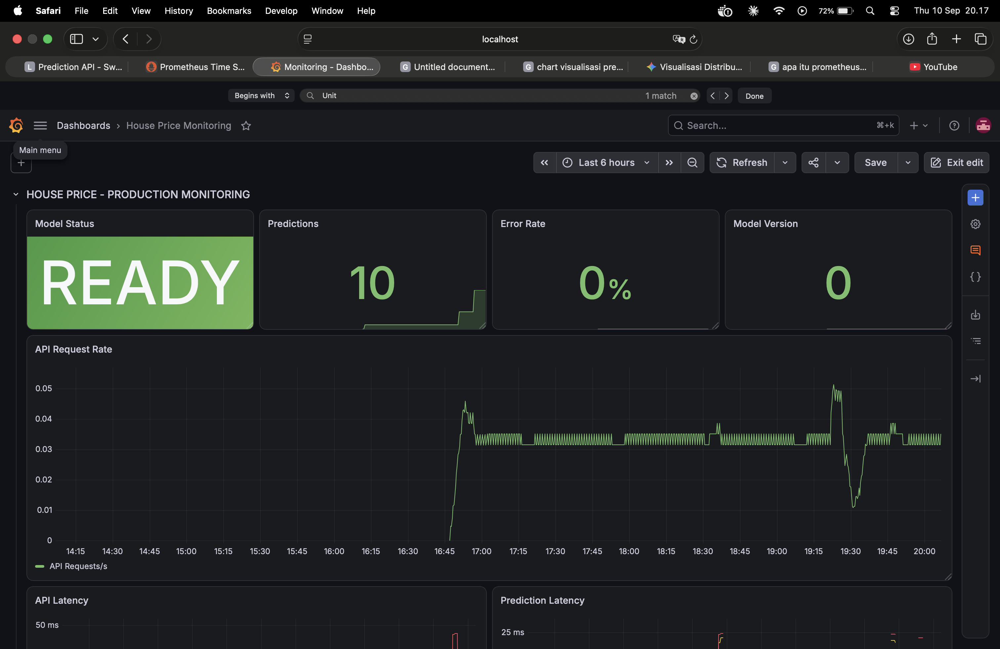
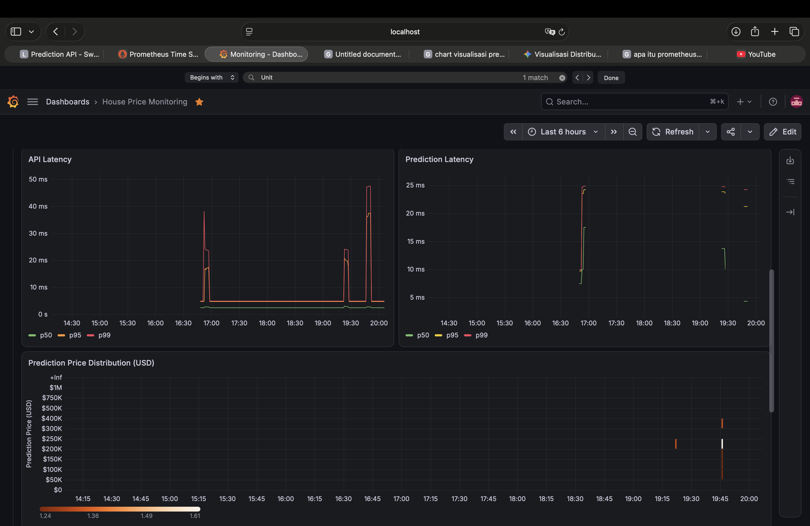
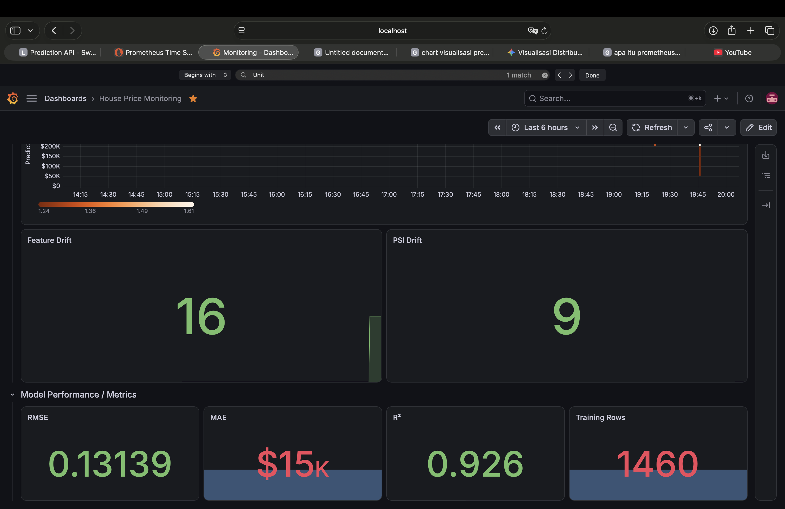
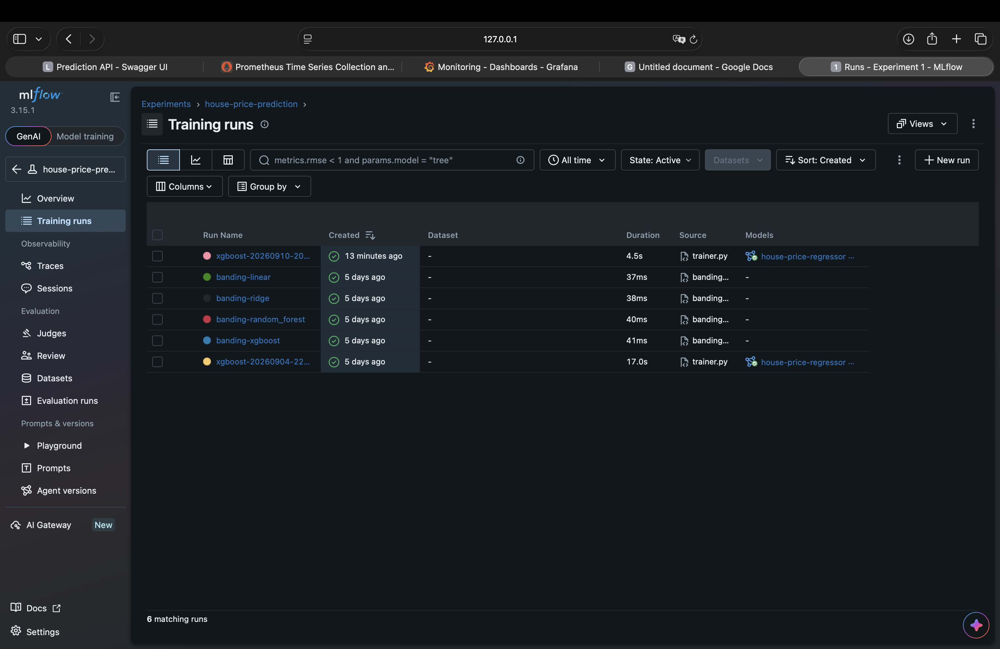
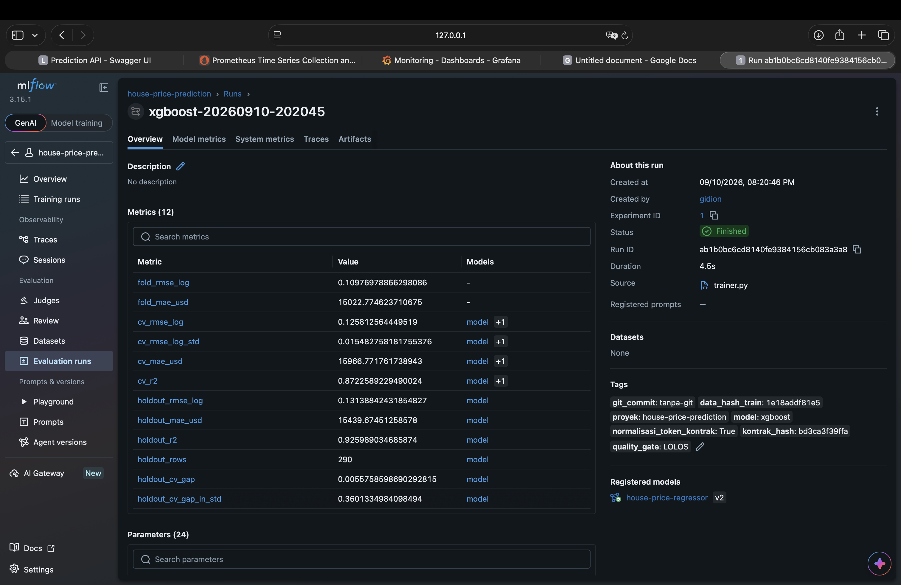
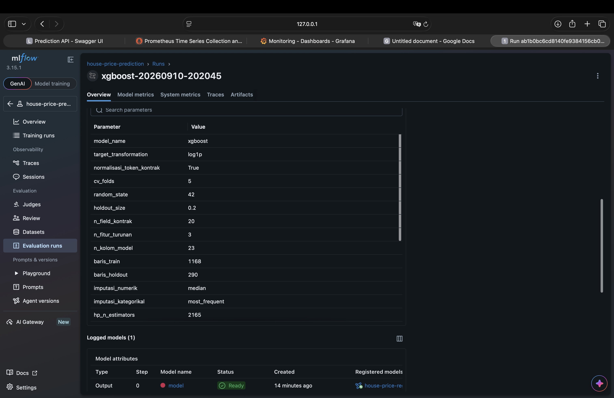
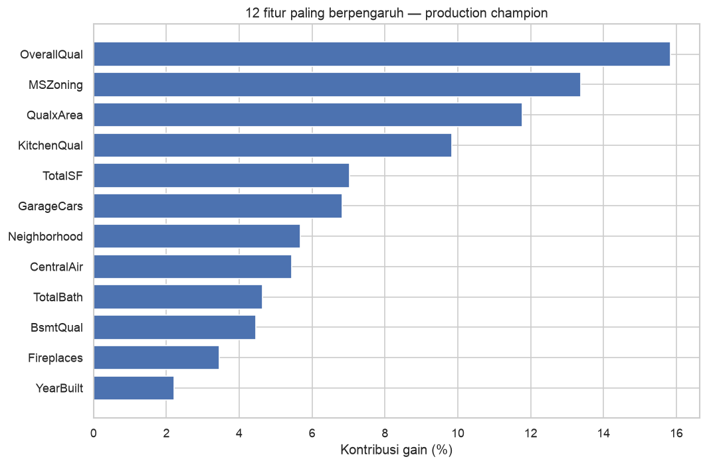
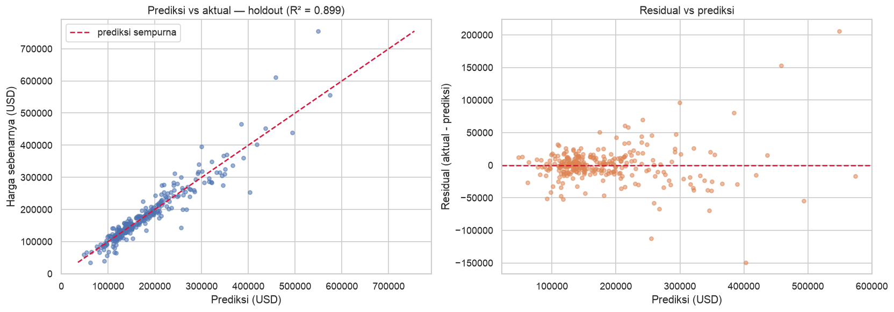
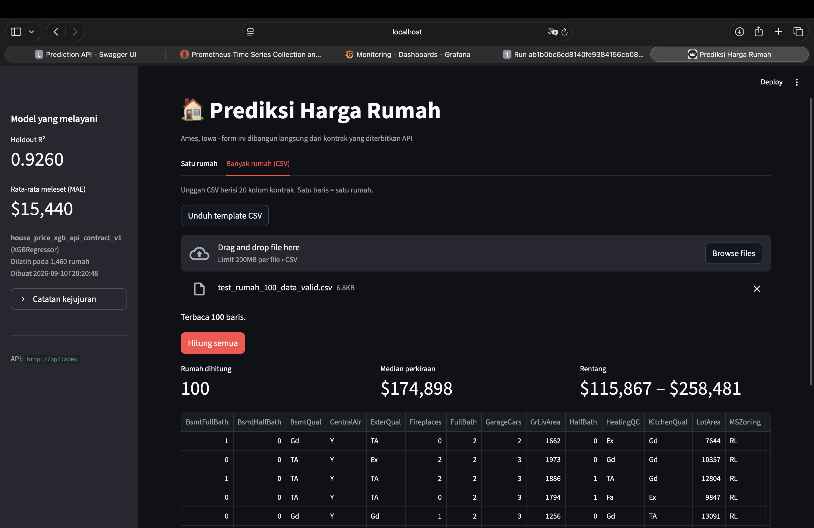

# House Price Prediction — End-to-End MLOps

<p align="center">
  <strong>From experimentation to a monitored machine learning service</strong>
</p>

<p align="center">
  <a href="#overview">Overview</a> ·
  <a href="#architecture">Architecture</a> ·
  <a href="#model-results">Model Results</a> ·
  <a href="#mlops-components">MLOps Components</a> ·
  <a href="#project-structure">Project Structure</a> ·
  <a href="#setup">Setup</a> ·
  <a href="#testing">Testing</a> ·
  <a href="#limitations">Limitations</a>
</p>

**[Your Name]** · [LinkedIn](YOUR_LINKEDIN_URL)

> This project started as a house price prediction problem, but the main goal is to build the complete path from experimentation to a maintainable, testable, deployable, and monitored ML service.

---

## Overview

This project predicts house sale prices using the **Ames Housing** dataset from Kaggle and turns the final model into an end-to-end MLOps system.

The project covers:

- exploratory data analysis and controlled experimentation;
- leakage-aware train/holdout splitting;
- preprocessing and feature engineering;
- cross-validation and hyperparameter tuning;
- quality gates before model promotion;
- MLflow experiment tracking and model registry;
- FastAPI model serving with Pydantic contracts;
- Streamlit user interface for single and batch prediction;
- structured JSON logging;
- Prometheus metrics and Grafana monitoring;
- data drift detection using KS, chi-square, and PSI;
- Docker and Docker Compose deployment;
- automated tests across the main project layers.

The dataset is from the [House Prices - Advanced Regression Techniques](https://www.kaggle.com/c/house-prices-advanced-regression-techniques) competition.

> The dataset is only the vehicle. The main focus of this project is how a machine learning model is moved from an experiment into a controlled production workflow.

---

## Project Status

| Component | Status |
|---|---|
| Modular ML code | ✅ |
| MLflow experiment tracking | ✅ |
| MLflow Model Registry | ✅ |
| `@champion` model alias | ✅ |
| FastAPI + Pydantic | ✅ |
| Streamlit UI | ✅ |
| Structured logging | ✅ |
| Prometheus metrics | ✅ |
| Grafana dashboard | ✅ |
| Drift detection | ✅ |
| Docker Compose | ✅ |
| Automated tests | ✅ 145 tests |
| Production artifact | ✅ |
| End-to-end verification | ✅ |

The current local MLflow Registry state used during the final verification is:

```text
Registered model : house-price-regressor
Champion version : 2
Alias            : @champion
Run ID           : ab1b0bc6cd8140fe9384156cb083a3a8
Contract hash    : bd3ca3f39ffa...
```

The MLflow Registry is currently backed by a local SQLite database. It is suitable for this single-machine project, but a shared remote tracking server is recommended for a team or larger production environment.

---

## Architecture

```text
                              USER
                               │
                               ▼
                     ┌──────────────────┐
                     │    Streamlit     │
                     │    :8501         │
                     │    FRONTEND      │
                     └────────┬─────────┘
                              │ HTTP
                              ▼
                     ┌──────────────────┐
                     │     FastAPI      │
                     │      :8000       │
                     │     BACKEND      │
                     └────────┬─────────┘
                              │
                 ┌────────────┴────────────┐
                 ▼                         ▼
        ┌────────────────┐       ┌────────────────┐
        │ Preprocessing  │       │     XGBoost    │
        │ + Feature FE   │──────►│     Model      │
        └────────────────┘       └───────┬────────┘
                                         │
                                         ▼
                                  House Price
                                   Prediction
                                         │
                       ┌─────────────────┼─────────────────┐
                       │                 │                 │
                       ▼                 ▼                 ▼
                 JSON Logging       Prometheus          MLflow
                       │                 │            Tracking /
                       ▼                 ▼             Registry
              logs/predictions.log     Grafana
```

### Runtime services

| Service | Port | Purpose |
|---|---:|---|
| Streamlit | `8501` | User-facing prediction UI |
| FastAPI | `8000` | Model serving and HTTP API |
| Prometheus | `9090` | Metrics collection |
| Grafana | `3000` | Monitoring dashboard |
| MLflow UI | `5000` | Local experiment and registry UI |

Streamlit is intentionally separated from the backend. It communicates with FastAPI over HTTP and does not import the ML backend directly.

Prometheus uses a pull model: it scrapes metrics from the API. The API does not need to know whether Prometheus is running.

---

## Production Model

The production champion is a **single XGBoost model** using the 20-field API contract.

### Target

The model is trained on:

```text
log1p(SalePrice)
```

Predictions are converted back to USD with the inverse transform:

```text
expm1(prediction)
```

The production artifact contains the preprocessing pipeline, model, API contract, target transformation information, quality evidence, and related metadata.

### API contract

The model accepts **20 user-provided fields**.

#### Numeric — 13 fields

```text
OverallQual
OverallCond
GrLivArea
TotalBsmtSF
LotArea
YearBuilt
YearRemodAdd
GarageCars
FullBath
HalfBath
BsmtFullBath
BsmtHalfBath
Fireplaces
```

#### Categorical — 7 fields

```text
Neighborhood
MSZoning
ExterQual
BsmtQual
KitchenQual
HeatingQC
CentralAir
```

The categorical choices are based on values observed in the training data rather than an assumed external list.

`BsmtQual` uses the API token `"None"` for houses without a basement. The backend converts that token back to a missing value before preprocessing so the API representation remains consistent with the training data.

### Server-derived features

The user does not need to provide these fields:

```text
TotalSF
TotalBath
QualxArea
```

They are calculated by the backend.

### Features removed because of temporal leakage

```text
MoSold
YrSold
SaleType
SaleCondition
```

These fields are only known after the house has been sold and therefore are not available at prediction time.

---

## Model Results

The final experiment selected XGBoost as the production model.

### Production holdout results

| Metric | Result |
|---|---:|
| CV RMSE Log, 5-fold | **0.12581 ± 0.01548** |
| Holdout RMSE Log | **0.13139** |
| Holdout MAE | **$15,439.67** |
| Holdout R² | **0.92599** |
| Holdout rows | **290** |
| Final training rows | **1,460** |
| Encoded model columns | **65** |
| Contract hash | `bd3ca3f39ffa...` |

The holdout is evaluated only after the modeling decisions are locked. The final production artifact is then retrained on all 1,460 labeled rows.

### Why XGBoost single model?

The production experiment also evaluated a blend of XGBoost and LightGBM.

The best 20-field blend achieved:

```text
Blend CV RMSE_log : 0.12522
XGBoost CV RMSE   : 0.12581
Improvement       : ~0.47%
```

The production decision rule requires at least **1% improvement** before the additional complexity of a blend is accepted.

Therefore:

```text
Production model = XGBoost single
```

The decision is based on the production contract and the predefined complexity threshold, not only on which model has the smallest number.

---

## Experiment → Production Workflow

```text
Raw data
   │
   ▼
Validation
   │
   ▼
Train / Holdout split
   │
   ▼
Preprocessing + Feature Engineering
   │
   ▼
5-Fold Cross Validation
   │
   ▼
Quality Gate
   │
   ├── fail ──► stop
   │
   ▼
Holdout Evaluation
   │
   ▼
Final Retraining on all labeled data
   │
   ▼
Production Artifact
   │
   ├──────────────► MLflow Tracking / Registry
   │                         │
   │                         ▼
   │                    @champion
   │
   ▼
FastAPI
   │
   ├──────────────► Prometheus
   │                       │
   │                       ▼
   │                    Grafana
   │
   ▼
Streamlit
```

---

## MLOps Components

### 1. MLflow

MLflow is used for:

- experiment tracking;
- parameter and metric logging;
- artifact logging;
- model registration;
- model versioning;
- champion alias management.

The project uses the MLflow Model Registry model:

```text
house-price-regressor
```

with:

```text
@champion
```

as the mutable reference to the model intended for production.

At the time of the final verification:

```text
@champion → version 2
```

The promotion workflow follows a champion–challenger pattern. A candidate must pass the project quality checks and promotion rules before the champion alias is changed.

For this project, MLflow is currently local:

```text
mlflow.db
mlruns/
```

This is intentionally kept out of Git.

---

### 2. Automatic model switching

The project separates two decisions:

**Automatic promotion**

```text
Training
   ↓
Evaluation
   ↓
Quality Gate
   ↓
MLflow @champion
```

**Automatic switching**

```text
FastAPI
   ↓
detects a new model state
   ↓
loads candidate separately
   ↓
validates contract
   ↓
runs a prediction check
   ↓
atomic model swap
```

FastAPI does not decide which model is better. The promotion logic remains in the training/registry layer.

The previous model remains available while the candidate is validated. If loading or validation fails, the existing serving model continues to serve traffic.

---

### 3. FastAPI + Pydantic

FastAPI is the backend serving layer.

Main API capabilities include:

| Endpoint | Purpose |
|---|---|
| `POST /predict` | Predict one house |
| `POST /predict/batch` | Predict up to 100 houses |
| `GET /health` | Liveness check |
| `GET /ready` | Readiness check |
| `GET /model-info` | Active model information |
| `GET /metrics` | Prometheus metrics |
| `GET /monitoring/drift` | On-demand drift analysis |
| `POST /admin/reload` | Reload the model |
| `POST /admin/rollback` | Roll back the champion |
| `GET /model/status` | Active vs. registry model status |

The request schema uses:

```text
extra = "forbid"
```

so unknown fields are rejected instead of silently ignored.

The API contract is also checked against the centralized configuration during application startup.

---

### 4. Streamlit

The Streamlit application is a separate frontend.

It provides two main flows:

```text
Satu rumah
Banyak rumah (CSV)
```

The frontend reads the backend contract from:

```text
/openapi.json
```

instead of maintaining a second hard-coded copy of the API contract.

The batch interface accepts a CSV with the 20 contract fields and sends the rows to:

```text
POST /predict/batch
```

The frontend does not load the XGBoost model itself.

```text
Streamlit
    │
    │ HTTP
    ▼
FastAPI
    │
    ▼
Model
```

This keeps the inference path centralized.

---

### 5. Logging

Prediction events are written as structured JSON logs.

Main file:

```text
logs/predictions.log
```

Structured logging makes the prediction history usable for later analysis, including drift monitoring.

---

### 6. Prometheus + Grafana

Prometheus collects API and model-serving metrics.

Grafana visualizes:

- model status;
- prediction count;
- error rate;
- active model version/status;
- API request rate;
- API latency;
- prediction latency;
- prediction price distribution;
- feature drift;
- PSI drift;
- RMSE;
- MAE;
- R²;
- training row count.

The monitoring stack is defined in:

```text
monitoring/
```

and can be started with Docker Compose.

---

### 7. Drift Detection

The project uses two complementary approaches:

```text
Statistical test
├── Kolmogorov-Smirnov for numeric features
└── Chi-square for categorical features

PSI
└── measures the size of the distribution change
```

Bonferroni correction is applied because multiple features are tested.

The drift analysis is currently **on-demand**:

```bash
python -m src.monitor --window 200
```

or:

```bash
curl "http://localhost:8000/monitoring/drift?window=200"
```

A production system would normally run this analysis on a schedule.

---

## Monitoring Screenshots

### Grafana Dashboard — Overview



### Grafana Dashboard — Performance



### Grafana Dashboard — Drift and Model Monitoring



---

## MLflow Screenshots

### MLflow Training Runs



### MLflow Metrics



### MLflow Logged Model Parameters



---

## Model Diagnostics

### Feature Importance



### Holdout Diagnostics



---

## Streamlit Batch Prediction

The Streamlit frontend was also tested with a 100-row CSV batch.



The batch interface uses the same 20-field API contract and sends the prediction request to the FastAPI backend.

---

## Project Structure

```text
house_price_prediction/
│
├── notebooks/
│   └── 01_experiment.ipynb
│       # Research: EDA → tuning → champion → production handoff
│
├── config/
│   └── config.yaml
│       # Central source for API contract, hyperparameters, and quality thresholds
│
├── data/
│   ├── raw/
│   │   # train.csv, test.csv, data_description.txt
│   │   # NOT committed to Git
│   └── processed/
│
├── src/                              # BACKEND — ML logic
│   ├── data/
│   │   ├── data_loader.py            # load → validate → split → holdout purification
│   │   └── data_preprocessor.py      # contract tokens → derived features → preprocessing
│   │
│   ├── models/
│   │   ├── model.py                  # estimator factory, hyperparameters from config
│   │   ├── trainer.py                # CV → gate → holdout → retrain → export → registry
│   │   └── predict.py                # single inference path for CLI and API
│   │
│   ├── utils/
│   │   ├── config.py                 # config.yaml + .env configuration
│   │   ├── logger.py                 # structured JSON logging
│   │   ├── metrics.py                # Prometheus metrics
│   │   └── tracking.py               # MLflow tracking, registry, @champion promotion
│   │
│   └── monitor.py                    # KS, chi-square, and PSI drift detection
│
├── api/                              # BACKEND — HTTP layer
│   ├── schemas.py                    # Pydantic request / response / error contracts
│   ├── service.py                    # model state and champion switching
│   └── main.py                       # FastAPI routes, middleware, exception handling
│
├── frontend/                         # FRONTEND — isolated Streamlit application
│   ├── app.py                        # single-house and batch CSV UI
│   ├── kontrak.py                    # reads contract from /openapi.json
│   ├── requirements.txt              # frontend-only dependencies
│   └── Dockerfile
│
├── scripts/
│   ├── verifikasi.py                 # end-to-end verification
│   └── registry.py                   # inspect and manage MLflow Registry
│
├── tests/                            # 145 automated tests
│   ├── conftest.py
│   ├── test_config.py                # contract, thresholds, categories
│   ├── test_data_loader.py           # CSV loading, validation, purification
│   ├── test_preprocessor.py          # feature engineering and pipeline
│   ├── test_tracking.py              # MLflow, contract hash, promotion rules
│   ├── test_predict.py               # inference path
│   ├── test_api.py                   # endpoints and validation
│   ├── test_monitor.py               # KS, chi-square, PSI
│   ├── test_monitoring_config.py     # Prometheus and alert rules
│   ├── test_model_source.py          # file / registry / auto source
│   ├── test_switching.py             # atomic model switching
│   └── test_frontend.py              # frontend/backend boundary
│
├── monitoring/
│   ├── prometheus.yml                # Prometheus scrape configuration
│   ├── alerts.yml                    # alert rules
│   └── grafana/
│       ├── dashboards/house-price.json
│       └── provisioning/             # datasource + dashboard provisioning
│
├── models/
│   ├── house_price_champion.joblib
│   └── house_price_champion_metadata.json
│   # Production artifacts — NOT committed to Git
│
├── logs/
│   └── predictions.log               # structured prediction logs
│
├── reports/
│   ├── drift_report.json
│   └── figures/                      # project screenshots and figures
│
├── submissions/                      # optional Kaggle outputs
│
├── mlflow.db                         # local MLflow tracking store — NOT committed
├── mlruns/                           # local MLflow artifacts — NOT committed
│
├── Dockerfile                        # backend image
├── docker-compose.yml                # API + Streamlit + Prometheus + Grafana
├── requirements.txt                  # production dependencies
├── requirements-dev.txt              # development / notebook / test dependencies
├── pytest.ini
├── .env.example                      # environment template
├── .dockerignore
├── .gitignore
└── README.md
```

> Personal learning notes under `docs/` are intentionally kept outside the public repository. See the Git ignore section below.

---

## Methodology

The modeling workflow follows a leakage-aware CRISP-DM style process.

```text
1. Business context
        ↓
2. Data loading and structural checks
        ↓
3. Deterministic preprocessing
        ↓
4. Train / holdout split
        ↓
5. Train-only cleaning and EDA
        ↓
6. Feature engineering and preprocessing pipeline
        ↓
7. Baseline and model experiments
        ↓
8. Hyperparameter tuning with CV
        ↓
9. Holdout evaluation
        ↓
10. Model interpretation
        ↓
11. Production contract selection
        ↓
12. Final artifact + MLflow registration
        ↓
13. API + monitoring + UI
```

The important rule is:

> Split first. Any operation that learns statistics from multiple rows must be fitted using training data only.

This prevents preprocessing, feature selection, and other learned transformations from leaking information from the holdout set.

---

## Quality Gates

The project does not promote a model only because it produces a lower CV score.

The production workflow checks:

- CV RMSE threshold;
- comparison against the API baseline;
- API contract compatibility;
- leakage checks;
- clean holdout availability;
- model hyperparameter availability;
- consistency between model and preprocessing artifact.

Only a model that passes the required checks can continue through the production workflow.

---

## Reproducibility

The project keeps the important pieces needed to reproduce the workflow:

```text
Code
+ Data
+ Environment
+ Random state
```

MLflow tracking also records experiment information, model parameters, metrics, tags, and artifacts.

The production artifact stores the contract hash:

```text
bd3ca3f39ffa...
```

so the model can be checked against the API contract that it was trained for.

---

## Running the Project

### Option 1 — Docker Compose

This is the recommended way to run the complete application.

```bash
cp .env.example .env

docker compose up -d --build

docker compose ps
```

Then open:

| Service | URL |
|---|---|
| Streamlit | http://localhost:8501 |
| FastAPI Swagger | http://localhost:8000/docs |
| Prometheus | http://localhost:9090 |
| Grafana | http://localhost:3000 |

To inspect API logs:

```bash
docker compose logs -f api
```

To stop the stack:

```bash
docker compose down
```

---

### Option 2 — Local development

Create the environment:

```bash
conda create -n house-price-mlops python=3.12 -y
conda activate house-price-mlops
```

Install development dependencies:

```bash
pip install -r requirements-dev.txt
```

Create the local environment file:

```bash
cp .env.example .env
```

Run the main services separately:

```bash
python -m src.models.trainer
```

```bash
uvicorn api.main:app --reload --port 8000
```

```bash
streamlit run frontend/app.py
```

Run MLflow UI:

```bash
mlflow ui --backend-store-uri sqlite:///mlflow.db --port 5000
```

Run drift analysis:

```bash
python -m src.monitor --window 200
```

---

## Verification and Testing

Run the complete test suite:

```bash
pytest
```

The project contains **145 automated tests** covering configuration, data loading, preprocessing, tracking, inference, API behavior, monitoring, model source selection, model switching, and frontend/backend separation.

Run the end-to-end verification:

```bash
python -m scripts.verifikasi --lengkap
```

The verification script checks the main project layers without replacing the test suite.

---

## Known Limitations

This project is designed as a complete learning and portfolio MLOps system, but it is still a single-machine project.

### 1. Data drift is not concept drift

The monitoring stack can detect changes in feature and prediction distributions. It cannot determine whether the relationship between features and real sale prices has changed.

### 2. The prediction interval is an estimate

The 80% prediction interval is based on the model's error behavior and should not be interpreted as a guaranteed statistical interval for every price range.

### 3. Geographic and temporal scope

The model is trained on Ames, Iowa housing data from the 2006–2010 period. It should not be assumed to generalize to another housing market or time period without validation.

### 4. Local MLflow Registry

The current Registry uses SQLite and local artifacts. This is appropriate for a single-machine project but is not the preferred setup for a multi-user production environment.

### 5. Docker and local MLflow artifacts

The current Docker deployment serves the production artifact from the project's model artifact path. A shared remote MLflow Tracking Server and artifact store would be the next step for a more distributed production architecture.

### 6. Single-worker serving

The current monitoring and model-switching design assumes a single Uvicorn worker. Multiple workers or replicas would require additional coordination.

### 7. Drift analysis is on-demand

The drift analysis currently runs when requested. A production environment would normally schedule the analysis as a recurring job.

---

## What I Learned From This Project

The main lesson from this project is not the final house price prediction.

It is the transition from:

```text
Notebook
   ↓
Model
```

to:

```text
Experiment
   ↓
Evaluation
   ↓
Quality Gate
   ↓
Artifact
   ↓
MLflow Registry
   ↓
FastAPI
   ↓
Streamlit
   ↓
Prometheus
   ↓
Grafana
```

A model is not finished when it has a good score.

It needs a clear input contract, reproducible preprocessing, quality checks, versioning, serving, monitoring, testing, and a controlled way to change the model.

---

## Repository Notes

The following files and directories are intentionally not committed:

```text
data/raw/
models/
mlflow.db
mlruns/
logs/
docs/
.env
```

The dataset and production artifacts can be generated or restored locally as part of the setup process.

The screenshots and figures under:

```text
reports/figures/
```

are intentionally committed because they document the experiment, MLflow, Streamlit, and monitoring results.

---

## License

This project is intended for educational and portfolio purposes.

The Ames Housing dataset is provided through the Kaggle House Prices competition. Please refer to the original Kaggle dataset and competition terms for dataset licensing and usage conditions.

---

## Author

**[Your Name]**

[LinkedIn](YOUR_LINKEDIN_URL)
